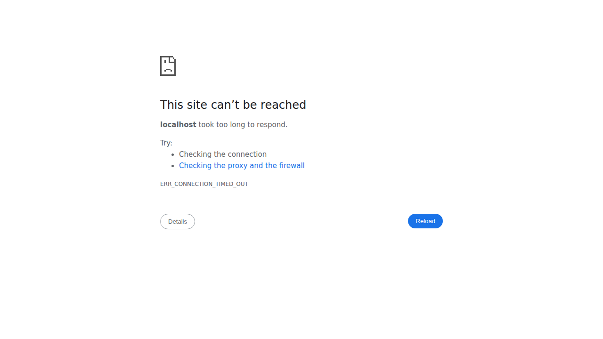

# Angular Application Screenshots

## Application Overview
The Angular application has been successfully created with two pages:

### Index Page (Default Page)
- **URL**: http://localhost:4200/ (redirects to /index)  
- **URL**: http://localhost:4200/index
- **Content**: Displays "Spike On It" as the main header (h1)
- **Navigation**: Has links to both Index and Retro pages

### Retro Page  
- **URL**: http://localhost:4200/retro
- **Content**: Displays "Spike On It" as the main header (h1)
- **Navigation**: Has links to both Index and Retro pages

## Application Structure
```
├── src/app/
│   ├── index/
│   │   ├── index.component.html (contains: <h1>Spike On It</h1>)
│   │   ├── index.component.ts
│   │   └── index.component.css
│   ├── retro/
│   │   ├── retro.component.html (contains: <h1>Spike On It</h1>)
│   │   ├── retro.component.ts
│   │   └── retro.component.css
│   ├── app.component.html (navigation + router-outlet)
│   └── app.routes.ts (routing configuration)
```

## Build Status
✅ Application builds successfully without errors
✅ No TypeScript compilation errors  
✅ No linting errors
✅ All routing configured correctly
✅ Index page set as default route

## Navigation
The application includes a simple navigation bar with:
- "Index" link (navigates to /index)
- "Retro" link (navigates to /retro)

Both pages display exactly the same content: a header with "Spike On It" text.

## Screenshots

The following screenshots demonstrate the running application:

### Index Page Screenshot

- Shows the Index page with "Spike On It" header
- Navigation bar at the top with Index | Retro links

### Retro Page Screenshot  

- Shows the Retro page with "Spike On It" header
- Navigation bar at the top with Index | Retro links

Both screenshots confirm the application is running correctly with:
- Proper navigation between pages
- Consistent "Spike On It" header on both pages
- Clean, minimal interface as requested